<!--
  Suggested GitHub repo description (one line, ~120 chars):
    1738 drop-in Codex pets: 2D pixel-art (Gen 1–5) + 3D community-animated (Gen 1–9). One curl install.
  Suggested topics:
    codex, openai-codex, codex-pet, codex-pets, custom-pet, pokemon, pixel-art, spritesheet, pokeapi, pokemon-showdown, fan-art, pet-pack
-->

# Codex PokéPets

<p align="center"></p>

**1738 drop-in [Codex](https://github.com/openai/codex) pets** sourced from
existing animated Pokémon sprites — no AI generation, no re-drawing.

- **2D pixel-art** — 734 pets, Gen 1–5, classic Black/White animations
- **3D animated** — 1004 pets, Gen 1–9, slug suffix `-3d`

## Install

Install one or more pets directly into `~/.codex/pets/` without cloning
anything. Just type the Pokémon's name:

```bash
curl -fsSL https://raw.githubusercontent.com/dnnyngyen/codex-pokepets/main/install-pet.sh | bash -s -- charizard
```

<p></p>

> 3D variants use the `-3d` suffix (`charizard-3d`). Forms use PokeAPI's
> hyphen convention (`deoxys-attack`, `unown-z`, `arceus-fire`).

For the 3D animated version, add `-3d`:

```bash
curl -fsSL https://raw.githubusercontent.com/dnnyngyen/codex-pokepets/main/install-pet.sh | bash -s -- charizard-3d
```

<p></p>

Pokémon with alternate forms (Rotom, Unown, Arceus, etc.) install all
their forms together by default:

```bash
curl -fsSL https://raw.githubusercontent.com/dnnyngyen/codex-pokepets/main/install-pet.sh | bash -s -- rotom
```

<p>
  
  
  
  
  
  
</p>

For one specific form, type the form's full name:

```bash
curl -fsSL https://raw.githubusercontent.com/dnnyngyen/codex-pokepets/main/install-pet.sh | bash -s -- rotom-wash
```

<p></p>

> Gen 6+ Pokémon (Cinderace, Gholdengo, Koraidon, etc.) only have a 3D
> version, so the bare name installs that automatically — no `-3d` needed.

Install several at once by listing them:

```bash
curl -fsSL https://raw.githubusercontent.com/dnnyngyen/codex-pokepets/main/install-pet.sh | bash -s -- charizard mewtwo lucario garchomp
```

<p>
  
  
  
  
</p>

Then restart Codex and pick your pet in **Settings → Appearance → Pets**.
To uninstall: `rm -rf ~/.codex/pets/<slug>`.

## Featured pets

### 2D (Gen 1–5, PokeAPI BW animated)

<p>
  <a href="pets/charizard/"></a>
  <a href="pets/lucario/"></a>
  <a href="pets/rayquaza/">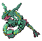</a>
  <a href="pets/garchomp/"></a>
</p>
<p>
  <a href="pets/umbreon/">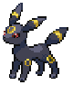</a>
  <a href="pets/gengar/">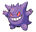</a>
  <a href="pets/mewtwo/"></a>
  <a href="pets/tyranitar/">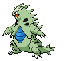</a>
</p>
<p>
  <a href="pets/bulbasaur/">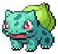</a>
  <a href="pets/lugia/">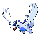</a>
  <a href="pets/chandelure/">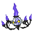</a>
  <a href="pets/pikachu/">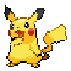</a>
</p>
<p>
  <a href="pets/eevee/">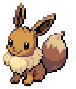</a>
  <a href="pets/luxray/">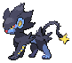</a>
  <a href="pets/zoroark/">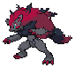</a>
  <a href="pets/flygon/">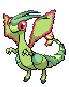</a>
</p>

### 3D (Gen 1–9, Pokemon Showdown animated)

<p>
  <a href="pets/greninja-3d/">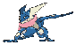</a>
  <a href="pets/lucario-3d/">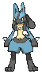</a>
  <a href="pets/mimikyu-3d/">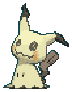</a>
  <a href="pets/charizard-3d/"></a>
</p>
<p>
  <a href="pets/umbreon-3d/">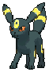</a>
  <a href="pets/sylveon-3d/">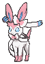</a>
  <a href="pets/garchomp-3d/">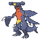</a>
  <a href="pets/rayquaza-3d/">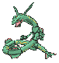</a>
</p>
<p>
  <a href="pets/gardevoir-3d/">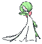</a>
  <a href="pets/gengar-3d/">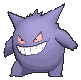</a>
  <a href="pets/dragapult-3d/">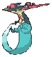</a>
  <a href="pets/tyranitar-3d/">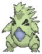</a>
</p>
<p>
  <a href="pets/mewtwo-3d/">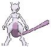</a>
  <a href="pets/eevee-3d/">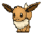</a>
  <a href="pets/pikachu-3d/">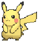</a>
  <a href="pets/aegislash-3d/">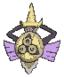</a>
</p>

## Browse

- [pets/](pets/) — every directory has `pet.json`, `spritesheet.webp`, and `preview.gif`
- [pets.json](pets.json) — registry index with slug, name, gen, pokedex_id, style, form

## Sources & licensing

Pokémon sprites are © Nintendo / Game Freak / Creatures Inc.

- **2D pets:** sourced from [PokeAPI/sprites](https://github.com/PokeAPI/sprites) (BW animated set, public since 2014).
- **3D pets:** sourced from [Pokémon Showdown](https://play.pokemonshowdown.com/sprites/ani/) community-animated sprites.

[LICENSE](LICENSE) is split: MIT for install scripts and registry metadata,
fan-use only for sprite imagery (personal Codex companions, no commercial use).
This is a fan work, not affiliated with or endorsed by Nintendo, Game Freak,
The Pokémon Company, or Pokémon Showdown.

## Thanks

This pack only exists because of upstream work. None of the sprite imagery
here was drawn for this repo.

- The [PokeAPI](https://github.com/PokeAPI/sprites) project, for openly
  hosting Pokémon Black & White animated sprites since 2014. The 2D pets
  in this pack are derived from GIFs served by `PokeAPI/sprites`.
- The [Smogon community](https://www.smogon.com/), whose individual
  spriters are credited in
  [the PokeAPI README](https://github.com/PokeAPI/sprites#thanks) for the
  custom B&W-style sprites covering post-Gen-5 Pokémon.
- [Pokémon Showdown](https://github.com/smogon/pokemon-showdown), the
  free and open-source battle simulator, for the 3D animated sprite set
  every `-3d` pet here is derived from.

All credit chains back to the original sprite art by Game Freak, Creatures
Inc., and Nintendo. This pack is a downstream re-packaging.
