<!--
  Suggested GitHub repo description (one line, ~120 chars):
    Every Pokémon as a Codex pet: 2D pixel-art (Gen 1–5) + 3D community-animated (Gen 1–9). One curl install.
  Suggested topics:
    codex, openai-codex, codex-pet, codex-pets, custom-pet, pokemon, pixel-art, spritesheet, pokeapi, pokemon-showdown, fan-art, pet-pack
-->

<h1 align="center">Codex PokéPets</h1>

<p align="center">
  <a href="pets/"></a>
  <a href="#"></a>
  <a href="LICENSE"></a>
</p>

<p align="center">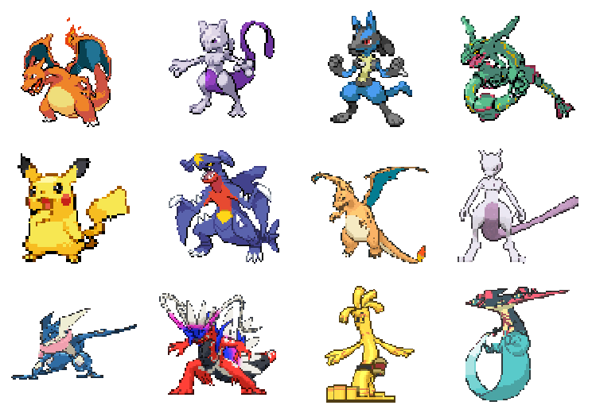</p>

**Every Pokémon as a [Codex](https://github.com/openai/codex) pet**,
sourced from existing animated sprites. No AI generation, no re-drawing.

- **2D pixel-art**: 649 Gen 1–5 Pokémon plus 85 alt forms
- **3D animated**: 1004 Gen 1–9 Pokémon (use `-3d` suffix)

## Install

Install one or more pets directly into `~/.codex/pets/` without cloning
anything. Just type the Pokémon's name:

```bash
curl -fsSL https://raw.githubusercontent.com/dnnyngyen/codex-pokepets/main/install-pet.sh | bash -s -- charizard
```

<p>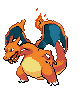</p>

> 3D variants use the `-3d` suffix (`charizard-3d`). Forms use PokeAPI's
> hyphen convention (`deoxys-attack`, `unown-z`, `arceus-fire`).

For the 3D animated version, add `-3d`:

```bash
curl -fsSL https://raw.githubusercontent.com/dnnyngyen/codex-pokepets/main/install-pet.sh | bash -s -- charizard-3d
```

<p>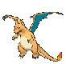</p>

Pokémon with alternate forms (Rotom, Unown, Arceus, etc.) install all
their forms together by default:

```bash
curl -fsSL https://raw.githubusercontent.com/dnnyngyen/codex-pokepets/main/install-pet.sh | bash -s -- rotom
```

<p>
  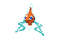
  
  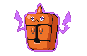
  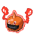
  
  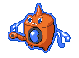
</p>

For one specific form, type the form's full name:

```bash
curl -fsSL https://raw.githubusercontent.com/dnnyngyen/codex-pokepets/main/install-pet.sh | bash -s -- rotom-wash
```

<p></p>

> Gen 6+ Pokémon (Cinderace, Gholdengo, Koraidon, etc.) only have a 3D
> version, so the bare name installs that automatically — no `-3d` needed.

Install several at once by listing them:

```bash
curl -fsSL https://raw.githubusercontent.com/dnnyngyen/codex-pokepets/main/install-pet.sh | bash -s -- charizard mewtwo lucario garchomp
```

<p>
  
  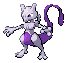
  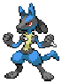
  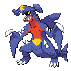
</p>

Then restart Codex and pick your pet in **Settings → Appearance → Pets**.
To uninstall: `rm -rf ~/.codex/pets/<slug>`.

## Watch your context (local companion)

Your Pokémon starts fully evolved and loses evolutions as context fills:
**Charizard → Charmeleon at 33% → Charmander at 66% → Poké Ball at 90%**.
Bulbasaur and Squirtle evolution lines are also available, in both 2D and 3D.

<p>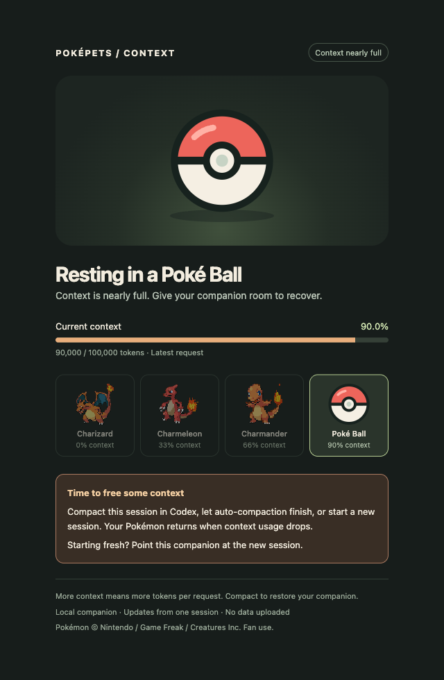</p>

The Poké Ball is a reminder to compact in Codex, allow auto-compaction to finish,
or start a new session. As soon as reported usage drops, the matching form returns
(for example, back to Charizard below 33%). This companion observes usage; it does
not run compaction. **Context fullness is not a response-quality score.**

This opt-in companion runs in a **local browser window**, using the existing
animated previews. It does **not** change the built-in Codex pet overlay:
the [custom pet contract](https://github.com/openai/skills/blob/main/skills/.curated/hatch-pet/references/codex-pet-contract.md)
has no context-usage callback. Ordinary pet installs still work as before.

Clone the pack and start the companion with Python 3.9+ (no packages to install):

```bash
git clone https://github.com/dnnyngyen/codex-pokepets.git
cd codex-pokepets
python3 evolve-pet.py charmander --session <session-uuid>
```

Open the `http://127.0.0.1:...` URL printed in the terminal. Keep the terminal
running; press **Ctrl+C** to stop. The browser updates once per second while open.

Use a session UUID from Codex's `/status` output (where available), or pass the
full path to that session's `rollout-*.jsonl` file under
`${CODEX_HOME:-$HOME/.codex}/sessions/YYYY/MM/DD/`. For example:

```bash
python3 evolve-pet.py squirtle --style 3d --session /path/to/rollout-session.jsonl
python3 evolve-pet.py bulbasaur --session <session-uuid> --thresholds 25 75 --ball-at 95
```

Each process follows **only the session you select**; open another process for
another session. The starter argument chooses the family: `charmander` begins as
Charizard. After starting a new Codex session, relaunch with its UUID/path.
The companion reads that file locally and serves only usage numbers and pet
assets on loopback. It does not upload data, serve conversation text, modify
Codex settings, install pets, or need API credentials.

Evolution uses `last_token_usage.total_tokens / model_context_window` from
Codex's `event_msg` → `token_count` records. This is the latest reported request's
context estimate, **not cumulative session spending**. It may differ from Codex's
displayed percentage, which can reserve baseline tokens. Thresholds are inclusive;
the form follows current usage after compaction or a model switch. Restarting the
companion replays that session's history to recover its latest state. A different
session starts fresh. Unknown usage shows the final form with a waiting indicator;
ephemeral sessions and
sessions without `token_count` telemetry cannot drive evolution. Rollout records
are an internal Codex format and may change between releases.

For the full-pack evolution and stats exploration, see
[evolution research](docs/evolution-research.md). Its proposed stat-based bands
are separate from this first implementation's configurable context thresholds.

Run the companion's tests with:

```bash
python3 -m unittest discover -s tests -v
```

## Featured pets

### 2D (Gen 1–5, PokeAPI BW animated)

<p align="center">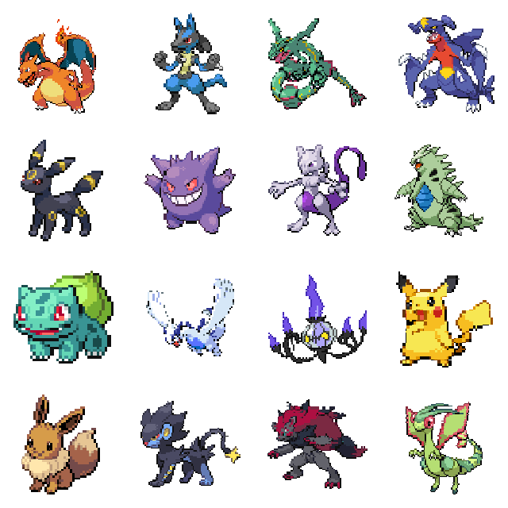</p>

Featured: charizard, lucario, rayquaza, garchomp, umbreon, gengar, mewtwo,
tyranitar, bulbasaur, lugia, chandelure, pikachu, eevee, luxray, zoroark,
flygon.

### 3D (Gen 1–9, Pokemon Showdown animated)

<p align="center">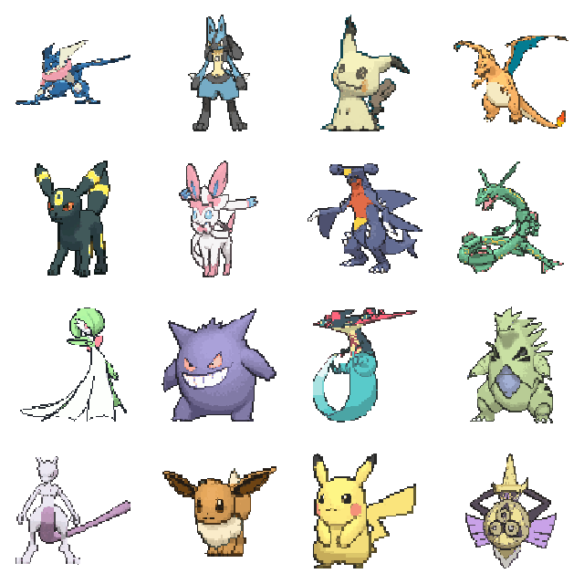</p>

Featured: greninja, lucario, mimikyu, charizard, umbreon, sylveon, garchomp,
rayquaza, gardevoir, gengar, dragapult, tyranitar, mewtwo, eevee, pikachu,
aegislash. (All install with `<name>-3d`.)

## Browse

- [pets/](pets/) — every directory has `pet.json`, `spritesheet.webp`, and `preview.gif`
- [pets.json](pets.json) — registry index with slug, name, gen, pokedex_id, style, form

## Sources & licensing

Pokémon sprites are © Nintendo / Game Freak / Creatures Inc.

- **2D pets:** sourced from [PokeAPI/sprites](https://github.com/PokeAPI/sprites) (BW animated set, public since 2014).
- **3D pets:** sourced from [Pokémon Showdown](https://play.pokemonshowdown.com/sprites/ani/) community-animated sprites.

[LICENSE](LICENSE) is split: MIT for install scripts and registry metadata,
fan-use only for sprite imagery (personal Codex companions, no commercial use).
This is a fan work, not affiliated with or endorsed by Nintendo, Game Freak,
The Pokémon Company, or Pokémon Showdown.

## Thanks

This pack only exists because of upstream work. None of the sprite imagery
here was drawn for this repo.

- The [PokeAPI](https://github.com/PokeAPI/sprites) project, for openly
  hosting Pokémon Black & White animated sprites since 2014. The 2D pets
  in this pack are derived from GIFs served by `PokeAPI/sprites`.
- The [Smogon community](https://www.smogon.com/), whose individual
  spriters are credited in
  [the PokeAPI README](https://github.com/PokeAPI/sprites#thanks) for the
  custom B&W-style sprites covering post-Gen-5 Pokémon.
- [Pokémon Showdown](https://github.com/smogon/pokemon-showdown), the
  free and open-source battle simulator, for the 3D animated sprite set
  every `-3d` pet here is derived from.

All credit chains back to the original sprite art by Game Freak, Creatures
Inc., and Nintendo. This pack is a downstream re-packaging.
